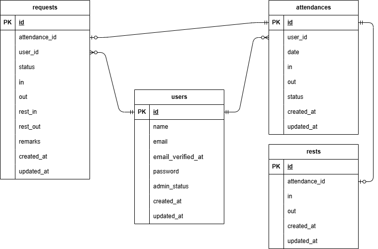

## アプリケーション名

勤怠アプリ

## プロジェクト概要

ユーザーの勤怠と管理を目的とするアプリの開発

## 環境構築

```
Docker ビルド
・git clone git@github.com:yuukuroda/kuroda-attendance.git
・docker-compose up -d --build

Laravel 環境構築
・docker-compose exec php bash
・composer install
・cp .env.example .env、環境変数を以下に変更

　　DB_CONNECTION=mysql
　　DB_HOST=mysql
　　DB_PORT=3306
　　DB_DATABASE=laravel_db
　　DB_USERNAME=laravel_user
　　DB_PASSWORD=laravel_pass

・php artisan migrate
・php artisan key:generate
・php artisan db:seed
・php artisan storage:link

"The stream or file could not be opened"エラーが発生した場合
src ディレクトリにある storage ディレクトリに権限を設定
chmod -R 777 storage
```

## テストユーザー

## テスト環境構築

```
テスト用のデータベースを作成
・docker-compose exec mysql bash
・mysql -u root -p
・CREATE DATABASE demo_test;

.env.testingの作成
・docker-compose exec php bash
・cp .env .env.testing、環境変数を以下に変更

　APP_ENV=test
　APP_KEY=

  DB_CONNECTION=mysql_test
  DB_HOST=mysql
  DB_PORT=3306
　DB_DATABASE=demo_test
　DB_USERNAME=root
　DB_PASSWORD=root

・php artisan key:generate --env=testing
・php artisan config:clear

テスト用データベースのテーブルを作成
・php artisan migrate --env=testing

テスト実行
・php artisan test

```

## URL

```
・ログイン画面（一般ユーザー）：http://localhost/login
・出勤登録画面：http://localhost/attendance
・ログイン画面（管理者）：http://localhost/admin/login
・勤怠一覧画面：http://localhost/addmin/attendance/list

```

## 使用技術（実行環境）

```
・php:8.1.33
・laravel:8.83.8
・mysql:8.0.26
・nginx:1.21.1
```

## ER 図


